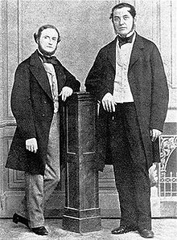
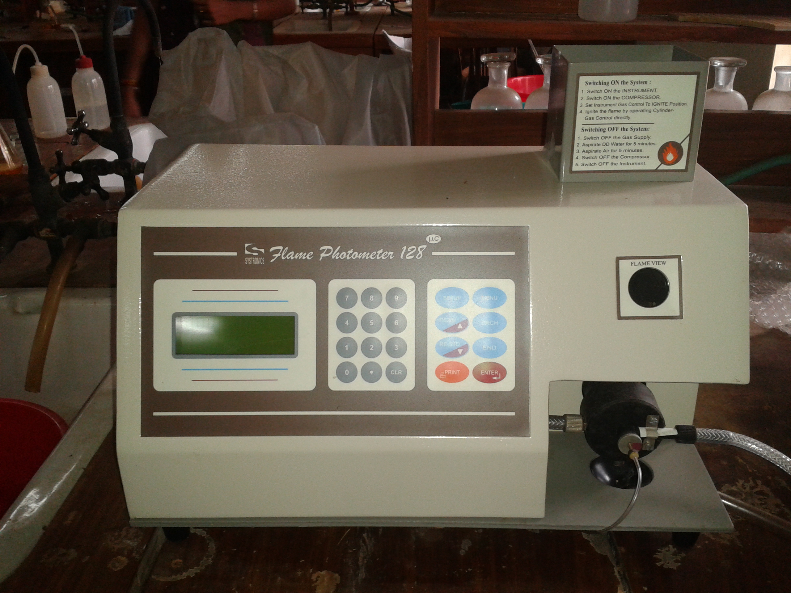
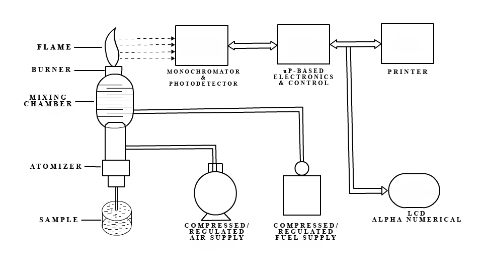
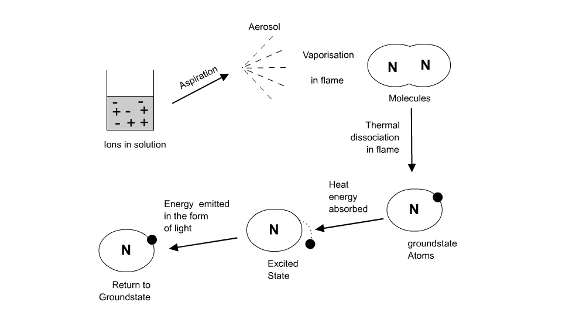
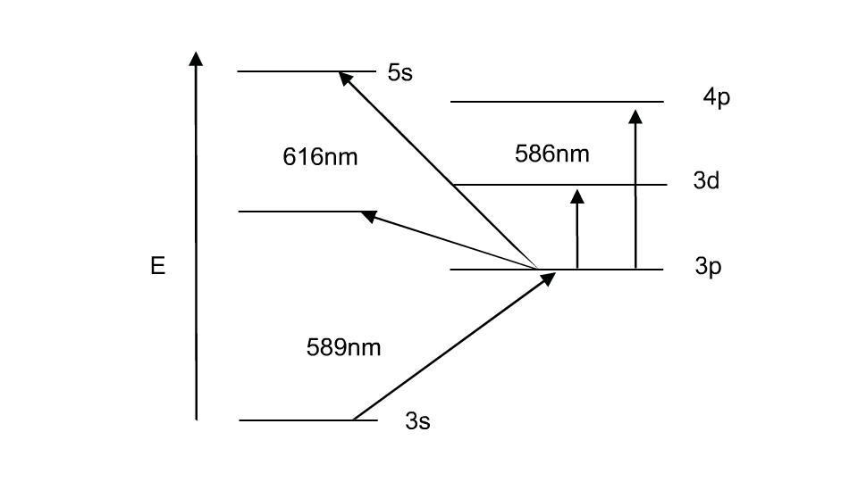

<h2>Introduction</h2>

Atomic spectroscopy is thought to be the oldest instrumental method for the determination of elements.
These techniques were introduced in the mid-19th century when Bunsen and Kirchhoff showed that the radiation emitted from flames depends on the characteristic element present in the flame.
The potential of atomic spectroscopy in both qualitative and quantitative analysis was then well established.
Developments in instrumentation led to the widespread application of atomic spectroscopy.
Atomic spectroscopy is an essential tool in analytical chemistry.

It is divided into three types: absorption, emission, and luminescence spectroscopy.
The different branches of atomic absorption spectroscopy are:

<ol>
  <li>Flame photometry or flame atomic emission spectrometry, in which the species is examined in the form of atoms</li>
  <li>Atomic absorption spectrophotometry (AAS)</li>
  <li>Inductively coupled plasma-atomic emission spectrometry (ICP-AES)</li>
</ol>

Gustav Kirchhoff (left) and Robert Bunsen (right)

<h2>Theory</h2>

Photoelectric flame photometry, a branch of atomic spectroscopy, is used for inorganic chemical analysis to determine the concentration of certain metal ions such as sodium, potassium, lithium, calcium, cesium, etc. In flame photometry, the species (metal ions) used in the spectrum are in the form of atoms.

The International Union of Pure and Applied Chemistry (IUPAC) Committee on Spectroscopic Nomenclature has recommended it as flame atomic emission spectrometry (FAES).

The basis of flame photometric working is that the species of alkali metals (Group 1) and alkaline earth metals (Group II) are dissociated due to the thermal energy provided by the flame source. Due to this thermal excitation, some atoms are excited to a higher energy level where they are not stable.

The absorbance of light due to electron excitation can be measured using direct absorption techniques. The subsequent loss of energy causes the excited atoms to return to the lower energy ground state, emitting radiation that can be observed in the visible region of the spectrum.

The wavelength of the emitted light is specific to each element, and the intensity of this emission can be measured using emission techniques.

Flame Photometer

<h2>Parts of a Flame Photometer</h2>

<ol>
  <li>
    <strong>Source of flame:</strong> 
    A burner that provides flame and can be maintained in a constant form and at a constant temperature.
  </li>

  <li>
    <strong>Nebuliser and mixing chamber:</strong> 
    Helps to transport the homogeneous solution of the substance into the flame at a steady rate.
  </li>

  <li>
    <strong>Optical system (optical filter):</strong> 
    The optical system comprises three parts: convex mirror, lens, and filter. The convex mirror helps to transmit light emitted from the atoms and focus the emissions to the lens. The convex lens helps to focus the light on a point called the slit. The reflections from the mirror pass through the slit and reach the filters. This isolates the wavelength to be measured from other extraneous emissions. Hence, it acts as an interference-type color filter.
  </li>

  <li>
    <strong>Photo detector:</strong> 
    Detects the emitted light and measures the intensity of radiation emitted by the flame. The emitted radiation is converted to an electrical signal with the help of a photo detector. The produced electrical signals are directly proportional to the intensity of light.
  </li>
</ol>

A schematic representation of the flame photometer is shown in figure 1.

Fig 1: A schematic representation of flame photometer

<h2>Mechanism of Working</h2>

The working of the flame photometer involves a series of steps, which are discussed in the following sections.

<h3>Nebulisation:</h3>

The solution of the substance to be analyzed is first aspirated into the burner, where it is dispersed into the flame as fine spray particles.

<h3>A Brief Overview of the Process:</h3>

<ol>
  <li>The solvent is first evaporated, leaving finely divided solid particles.</li>
  <li>These solid particles move towards the flame, where gaseous atoms and ions are produced.</li>
  <li>The ions absorb energy from the flame and are excited to high energy levels.</li>
  <li>When the atoms return to the ground state, radiation of the characteristic element is emitted.</li>
  <li>The intensity of emitted light is related to the concentration of the element.</li>
</ol>

Fig 2: Brief overview of the process

<h2>Events Occurring in the Flame</h2>

Flame photometry employs a variety of fuels, mainly air, oxygen, or nitrous oxide (N2O), as the oxidant. The temperature of the flame depends on the fuel-oxidant ratio.

The various processes in the flame are discussed below:

<ul>
  <li>
    <strong>Desolvation:</strong> The metal particles in the flame are dehydrated, and the solvent is evaporated.
  </li>
  <li>
    <strong>Vapourisation:</strong> The metal particles in the sample are dehydrated, which also leads to the evaporation of the solvent.
  </li>
  <li>
    <strong>Atomization:</strong> Reduction of metal ions in the solvent to metal atoms by the heat of the flame.
  </li>
  <li>
    <strong>Excitation:</strong> The electrostatic force of attraction between the electrons and the nucleus helps atoms absorb energy. The atoms then jump to the excited energy state.
  </li>
  <li>
    <strong>Emission process:</strong> Since the higher energy state is unstable, the atoms return to the stable low energy state, emitting energy as radiation of a characteristic wavelength, which is measured by the photo detector.
  </li>
</ul>

The energy level diagram of the sodium atom is shown in figure 3.

Fig 3:   Energy level diagram for atomic sodium

<h2>Light Intensity and the Scheibe-Lomakin Equation</h2>

The intensity of the light emitted can be described by the Scheibe-Lomakin equation:

<strong>I = k × cn</strong>

Where:

<ul>
  <li><strong>I</strong> = Intensity of emitted light</li>
  <li><strong>c</strong> = Concentration of the element</li>
  <li><strong>k</strong> = Constant of proportionality</li>
  <li><strong>n</strong> ≈ 1 (at the linear part of the calibration curve)</li>
</ul>

In the linear range, this simplifies to:

<strong>I = k × c</strong>

That is, the intensity of emitted light is directly related to the concentration of the sample.

Comparing the emission intensities of unknown samples to those of standard solutions (via a calibration curve) or to an internal standard (standard addition method) helps in the quantitative analysis of the analyte metal in the sample solution.

The flame emissions of alkali and alkaline earth metals, including their emission wavelengths and the characteristic colors produced by each element, are shown in Table 1.

<h2>Table 1: Flame Emissions of Alkali and Alkaline Earth Metals</h2>

<table>
  <tr>
    <th>Name of the Element</th>
    <th>Emitted Wavelength Range (nm)</th>
    <th>Observed Colour of the Flame</th>
  </tr>
  <tr>
    <td>Potassium (K)</td>
    <td>766</td>
    <td> Violet</td>
  </tr>
  <tr>
    <td>Lithium (Li)</td>
    <td>670</td>
    <td> Red</td>
  </tr>
  <tr>
    <td>Calcium (Ca)</td>
    <td>622</td>
    <td> Orange</td>
  </tr>
  <tr>
    <td>Sodium (Na)</td>
    <td>589</td>
    <td> Yellow</td>
  </tr>
  <tr>
    <td>Barium (Ba)</td>
    <td>554</td>
    <td> Lime green</td>
  </tr>
</table>

<h2>Applications</h2>

Flame photometer has both quantitative and qualitative applications. Flame photometers with monochromators emit radiations of characteristic wavelengths, which help to detect the presence of a particular metal in the sample. This helps to determine the availability of alkali and alkaline earth metals, which are critical for soil cultivation.

In agriculture, the fertilizer requirement of the soil is analyzed by flame test analysis of the soil. In the clinical field, Na+ and K+ ions in body fluids, muscles, and the heart can be determined by diluting the blood serum and aspirating it into the flame. Analysis of soft drinks, fruit juices, and alcoholic beverages can also be done using flame photometry.

<h2>Advantages</h2>

<ul>
  <li>Simple quantitative analytical test based on flame analysis.</li>
  <li>Inexpensive.</li>
  <li>The determination of elements such as alkali and alkaline earth metals is easy, reliable, and convenient.</li>
  <li>Quick, convenient, selective, and sensitive to even parts per million (ppm) to parts per billion (ppb) range.</li>
</ul>

<h2>Disadvantages</h2>

Although the flame photometer has a wide range of applications in analytical chemistry, it possesses several disadvantages:

<ul>
  <li>The concentration of the metal ion in the solution cannot be measured accurately.</li>
  <li>A standard solution with known molarities is required for determining the ion concentration corresponding to the emission spectra.</li>
  <li>It is difficult to obtain accurate results for ions with higher concentrations.</li>
  <li>Information about the molecular structure of the compound in the sample cannot be determined.</li>
  <li>Elements such as carbon, hydrogen, and halides cannot be detected due to their non-radiating nature.</li>
</ul>

